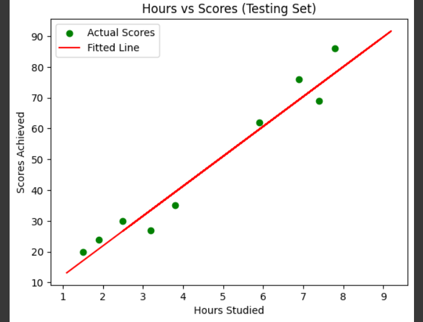

# Implementation-of-Simple-Linear-Regression-Model-for-Predicting-the-Marks-Scored

## AIM:
To write a program to predict the marks scored by a student using the simple linear regression model.

## Equipments Required:
1. Hardware – PCs
2. Anaconda – Python 3.7 Installation / Jupyter notebook

## Algorithm
1. Load the dataset into a DataFrame and explore its contents to understand the data structure.
2. Separate the dataset into independent (X) and dependent (Y) variables, and split them into training and testing sets.
3. Create a linear regression model and fit it using the training data.
4. Predict the results for the testing set and plot the training and testing sets with fitted lines.
5. Calculate error metrics (MSE, MAE, RMSE) to evaluate the model’s performance.

## Program:
```
/*
Program to implement the simple linear regression model for predicting the marks scored.
Developed by: RAHUL S 
RegisterNumber:  212224040259
*/
```
```
/*
# Importing necessary libraries
import pandas as pd
import numpy as np
import matplotlib.pyplot as plt
from sklearn.metrics import mean_absolute_error, mean_squared_error
from sklearn.model_selection import train_test_split
from sklearn.linear_model import LinearRegression

# Load the dataset
df = pd.read_csv("student_scores.csv")

# Display the first few rows of the dataset
print("First 5 rows of the dataset:")
print(df.head())

# Display the last few rows of the dataset
print("Last 5 rows of the dataset:")
print(df.tail())

# Separate the independent (X) and dependent (Y) variables
X = df.iloc[:, :-1].values  # Assuming the 'Hours' column is the first column
Y = df.iloc[:, 1].values    # Assuming the 'Scores' column is the second column

# Split the dataset into training and testing sets (1/3rd for testing)
X_train, X_test, Y_train, Y_test = train_test_split(X, Y, test_size=1/3, random_state=0)

# Create and train the Linear Regression model
regressor = LinearRegression()
regressor.fit(X_train, Y_train)

# Predict the test set results
Y_pred = regressor.predict(X_test)

# Display predicted and actual values for testing set
print("Predicted values:")
print(Y_pred)
print("Actual values:")
print(Y_test)

# Plot the Training set results
plt.scatter(X_train, Y_train, color="red", label="Actual Scores")
plt.plot(X_train, regressor.predict(X_train), color="blue", label="Fitted Line")
plt.title("Hours vs Scores (Training Set)")
plt.xlabel("Hours Studied")
plt.ylabel("Scores Achieved")
plt.legend()
plt.show()

# Plot the Testing set results
plt.scatter(X_test, Y_test, color='green', label="Actual Scores")
plt.plot(X_train, regressor.predict(X_train), color='red', label="Fitted Line")
plt.title("Hours vs Scores (Testing Set)")
plt.xlabel("Hours Studied")
plt.ylabel("Scores Achieved")
plt.legend()
plt.show()

# Calculate and print error metrics
mse = mean_squared_error(Y_test, Y_pred)
mae = mean_absolute_error(Y_test, Y_pred)
rmse = np.sqrt(mse)

print('Mean Squared Error (MSE) =', mse)
print('Mean Absolute Error (MAE) =', mae)
print('Root Mean Squared Error (RMSE) =', rmse)
*/
```

## Output:





## Result:
Thus the program to implement the simple linear regression model for predicting the marks scored is written and verified using python programming.
